Hello there 👋
I'm a Math Teacher, Coder, and interested in the development of computing tools at the intersection of those two interests!

Mathematics Teacher at Deerfield Academy;

    ⚙️ I use daily: .py, LaTeX
    🌍 I'm mostly active in coding copetitions
    💬 ping me about education, mathematics, problem-solving, and design thinking
    ⌨️  ZSA Moonlander/ZSA Ergodox EZ

